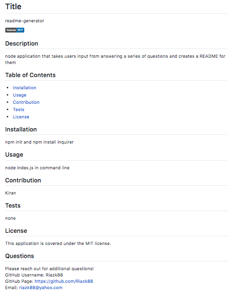

# README Generator!
You can quickly and easily create a README file by using a command-line application (README Generator) to generate one. This will allow you to devote more time working on the project!

## User Story
AS A developer
I WANT a README generator
SO THAT can quickly create a professional README for a new project

## Description
The README below was created using the README Generator. Check it out!

## Link to Demo Video

https://drive.google.com/file/d/1xL5PNf_Y9nQG9yHi_VRLpNssUxWAJZlf/preview
    